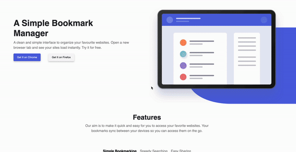

# Bootstrap-SASS
<div align="center"></div> 
<br>

[](https://getbootstrap.com/)
[](https://sass-lang.com/)
[](https://www.w3.org/Style/CSS/Overview.en.html)
[](https://html.spec.whatwg.org/)

This project uses **Bootstrap 5** and **SASS** to create an attractive and **responsive** landing page. It aims to provide a smooth and visually appealing user experience across various devices and screen sizes. The page features a fixed navigation menu, custom sections, and an adaptable design that adjusts to different screen resolutions. Bootstrap 5 is utilized for a flexible and modular design structure, while SASS manages and optimizes CSS styles to enhance the overall performance and maintainability of the page.

## Table of Contents

1. [Project Overview](#project-overview)
2. [Installation](#installation)
  2.1. [Troubleshooting](#troubleshooting)
3. [Main Features](#main-features)
4. [Image Project Gallery](#imgage-project-gallery)
5. [Contributing](#contributing)
6. [Contact](#contact)


## Project Overview

```
S1.2.-BOOTSTRAP-SASS/
├── assets/
│   ├── Captura de pantalla 2024-08-16 a las 17.13.00.png
│   ├── Captura de pantalla 2024-08-16 a las 17.13.11.png
│   ├── Captura de pantalla 2024-08-16 a las 17.13.22.png
│   ├── Captura de pantalla 2024-08-16 a las 17.13.30.png
│   ├── Diseño/
│   ├── Grabaciondepantalla2024-08-16alas17.14.46-ezgif.com-video-to-gif-converter.gif
│   ├── Imagenes/
│   └── index.html
└── src/
│    ├── style.css       
│    └── style.scss
├── node_modules/
├── package-lock.json
└── package.json
```

## Installation

To set up this project on your local machine, follow these steps:

### 1. Clone the Repository

Clone the repository from GitHub:

```bash
git clone https://github.com/Luovtyrell/S1.2.-Bootstrap-SASS.git
```

### 2. Navigate to the Project Directory

Change to the project directory:

```bash
cd S1.2.-Bootstrap-SASS
```

### 3. Install Dependencies

Make sure you have [Node.js](https://nodejs.org/) installed. Install the required dependencies using npm:

```bash
npm install
```

### 4. Compile SASS

Compile the SASS files into CSS by running:

```bash
npm run sass
```

This command will process the SASS files and generate the corresponding CSS files.

### 5. Run the Project Locally

To view the project in your browser using the **"Go Live"** extension in Visual Studio Code:

1. **Open Visual Studio Code** and navigate to the project directory.
2. **Install the "Live Server" Extension** if you haven’t already. You can find it in the Extensions Marketplace by searching for "Live Server" and installing it.
3. **Open the `index.html` file** in VS Code.
4. **Start the Live Server** by clicking the **"Go Live"** button in the bottom-right corner of the VS Code status bar. Alternatively, you can right-click the `index.html` file and select **"Open with Live Server"** from the context menu.

This will launch the project in your default web browser at `http://127.0.0.1:5500` (or another port if specified by the Live Server settings).

### Troubleshooting

If you encounter any issues:

- **Check Node.js Installation:** Confirm that Node.js and npm are correctly installed.
- **Verify Dependencies:** Run `npm install` to ensure all dependencies are installed.
- **SASS Compilation Issues:** Review the output from the SASS compiler for errors or warnings.
  - Verify SASS Syntax: Look for syntax errors in `src/style.scss`
- **Live Server Issues:** Ensure the Live Server extension is properly installed and configured. Check the VS Code output for any error messages.
- **Internet Explorer 11:** Some features may not be supported.
- **Older Browsers:** Design may not be fully responsive on very old browser versions.

For more information, visit the [Bootstrap Documentation](https://getbootstrap.com/docs/5.3/getting-started/introduction/), [SASS Documentation](https://sass-lang.com/documentation/basics), and [Node.js Guides](https://nodejs.org/en/docs/).


## Main Features

| Section                   | Description                                                                                  |
|---------------------------|----------------------------------------------------------------------------------------------|
| **Page Structure**        | The **Top Navigation Bar** is created using Bootstrap 5's `navbar` component to ensure a fixed navigation bar at the top of the page. The **Main Content** is divided into two columns using Bootstrap's responsive grid system. The left column contains text and buttons, while the right column contains an image. |
| **Custom Styles**         | The **Color Customization** is achieved using SASS to adjust Bootstrap’s primary and secondary colors. The **Primary Color** is #5265E1, and the **Secondary Color** is #FA5959. |
| **Product Features**      | The **"Features" Section** is displayed using Bootstrap’s `tabs` component. Styles are adapted with SASS to match the specified design. |
| **Download Area**         | The **Customized Cards** are created or adjusted for the download area, customized using SASS if Bootstrap cards are not directly adaptable to the design. |
| **FAQ Section**           | The **Accordion** is displayed using Bootstrap’s `accordion` component. Classes are customized to fit the required design. |
| **Footer**                | The **Subscription Form** is included for newsletter sign-ups. Form validation is implemented with Bootstrap to ensure the correct completion of input fields, such as email addresses. |
| **Responsiveness**        | Responsiveness is ensured with **Media Queries** to guarantee proper display on tablets and mobile devices using Bootstrap's grid system and media queries. |


## Image project gallery


| Img | Description |
|--------|------------------------------|
|  | Hero |
|  | Tabs |
|  | Cards |
|  | Accordion FAQ + Footer |


## Contributing

Contributions to the Star Wars Web Application are welcome! To contribute:

1. Fork the repository.
2. Create a new branch (`git checkout -b feature/YourFeature`).
3. Make your changes and commit (`git commit -am 'Add new feature'`).
4. Push to the branch (`git push origin feature/YourFeature`).
5. Create a new Pull Request.
<br>

---

## Contact

For questions or feedback, feel free to open an issue on the GitHub repository or contact me directly at:

<a href="mailto:luciaorvilanova@gmail.com" target="_blank" rel="noreferrer"></a> <a href="https://www.linkedin.com/in/luovtyrell" target="_blank" rel="noreferrer"></a> <a href="https://t.me/luovtyrell" target="_blank" rel="noreferrer"></a> <a href="http://discordapp.com/users/664163194989707308" target="_blank" rel="noreferrer"></a>

<br>

 > <br> [@Luovtyrell](https://www.github.com/Luovtyrell) 
